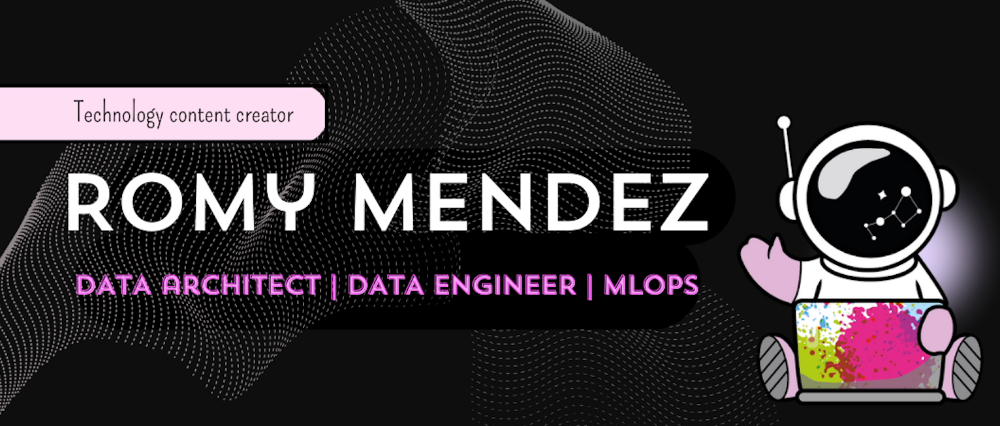

<h1 style="padding: 10px;">
    Hello! I am Romy Mendez 👋
</h1>

## 👩‍💻 Who am I?

I'm **Romy Mendez** ([@r0mymendez](https://r0mymendez.github.io/romymendezblog/blog.html)), currently working as a Data Cloud Architect and a professor at the **University of Belgrano**. I'm passionate about technology 🚀 and actively involved in social projects 🤝. If you're looking for collaboration on a specific project or need guidance for embarking on a new technological adventure, feel free to reach out to me through any of my social channels.

---

## Let's Stay Connected: Follow Us or Get in Touch

## Technologies

 

 

 

 

 

---

## ☕ Cup of Support: Elevate My Energy

